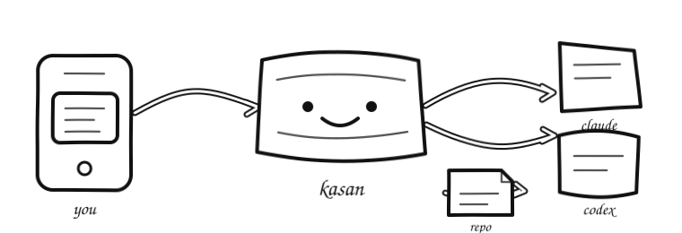

# kasan

<p align="center">
  <a href="LICENSE"></a>
  
  
  
</p>

<p align="center"><strong>A quiet control room for coding agents.</strong></p>

Run Claude Code or Codex on your own machine. Send it work from your phone,
close the page, and come back when it is done.

<p align="center">
  
</p>

## What it does

- Runs agents inside your repositories
- Keeps sessions alive without an open browser
- Streams replies, tool calls, errors, and status
- Resumes after idle time or a restart
- Gives agents Chromium tools for testing UIs
- Captures live previews for arrow, box, and freehand visual feedback
- Shows selectable SVG and image option galleries from the bundled asset-designer skill
- Works well from a phone over Tailscale

## Support

| | Claude Code | Codex |
| --- | :---: | :---: |
| Run and resume | ✅ | ✅ |
| Tool activity | ✅ | ✅ |
| Permission levels | ✅ | ✅ |
| Playwright browser | ✅ | ✅ |
| Custom MCP servers | ✅ | ✅ |
| Model picker | — | ✅ |

Included tools: Git, ripgrep, Chromium, Playwright, Python, build tools, curl,
jq, SQLite, ShellCheck, SVG Optimizer, librsvg, ImageMagick, lsof, and
`kasan-preview` for long-running dev servers.

## NixOS VM (recommended for a homelab)

Kasan includes a flake package and NixOS module. Run it as a native systemd
service in a dedicated VM when agents need access to the whole VM filesystem,
processes, and development toolchain. There is no Docker boundary in this
deployment.

See [the NixOS deployment guide](docs/nixos.md), including a Chimera-compatible
flake and host configuration.

## Docker

```bash
git clone https://github.com/mmerioles/kasan.git
cd kasan
cp .env.example .env
$EDITOR .env
docker compose up -d --build
```

Set `KASAN_PASSCODE` and `HOST_WORKSPACE` in `.env`, then sign in to the agent
you want.

There is no browser in the container, so the surest route is to mint a
credential where you do have one and pass it through `.env`:

```bash
claude setup-token            # on your laptop, where a browser can open
```

The browser shows you a **code** (it looks like `abc...#def...`). Paste that
back into the terminal that is still waiting. Only *then* does it print the
**token** — `sk-ant-oat01-...` — and the token is the part that goes in `.env`.
They are two different strings, and the code is single-use.

```bash
# .env
CLAUDE_CODE_OAUTH_TOKEN=sk-ant-oat01-...
```

`ANTHROPIC_API_KEY` and `OPENAI_API_KEY` work the same way. Or sign in inside
the container, copying the printed URL into a browser yourself:

```bash
docker compose exec kasan claude setup-token
docker compose exec kasan codex login --device-auth
```

Codex **needs** `--device-auth`; the plain form waits on a callback bound to
loopback inside the container that no browser can reach.

Verify with a real call, not with `auth status` — that only checks a credential
parses, and will happily report `loggedIn: true` for one the server rejects:

```bash
docker compose exec kasan claude -p "say OK"
```

Open [http://localhost:7777](http://localhost:7777).

For phone access, install Tailscale on both devices and open:

```text
http://<machine-name>:7777
```

Choose **just go**, **edits only**, or **read only** for each session. Mount only
repositories you trust an agent to access, and keep kasan on a private network.

Configuration lives in `.env`. Run `docker compose logs -f` when something
looks wrong. Sessions and credentials survive normal rebuilds and restarts.

Development is `npm install`, then
`KASAN_PASSCODE=dev KASAN_WORKSPACE=$HOME/repos npm run dev`.

MIT licensed. See [LICENSE](LICENSE).
